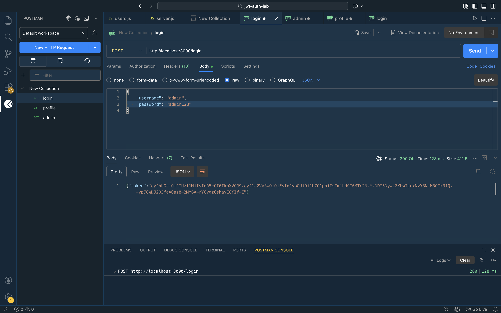
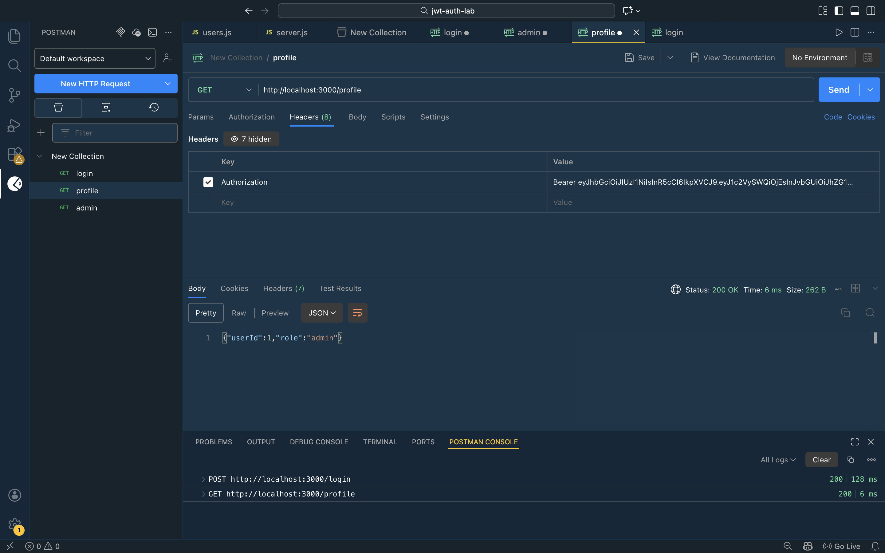
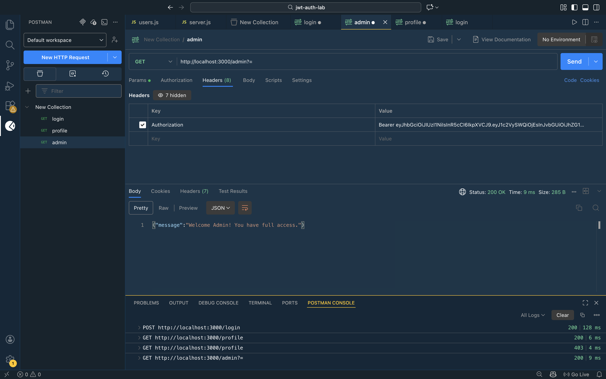
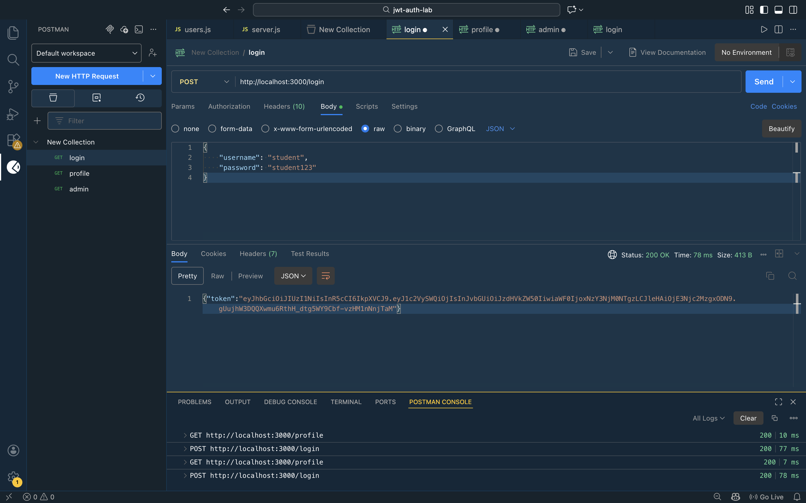
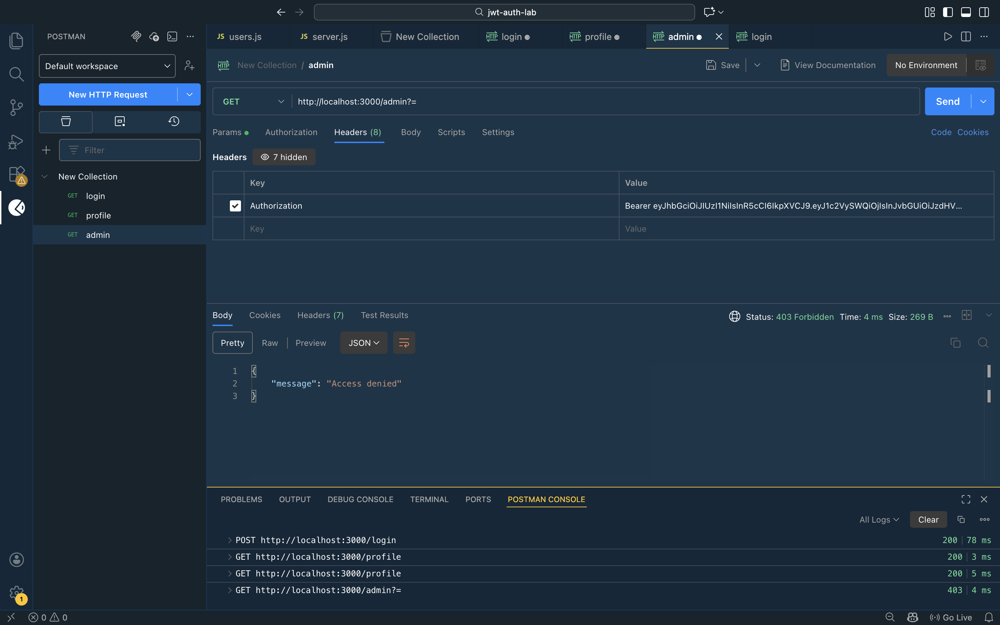
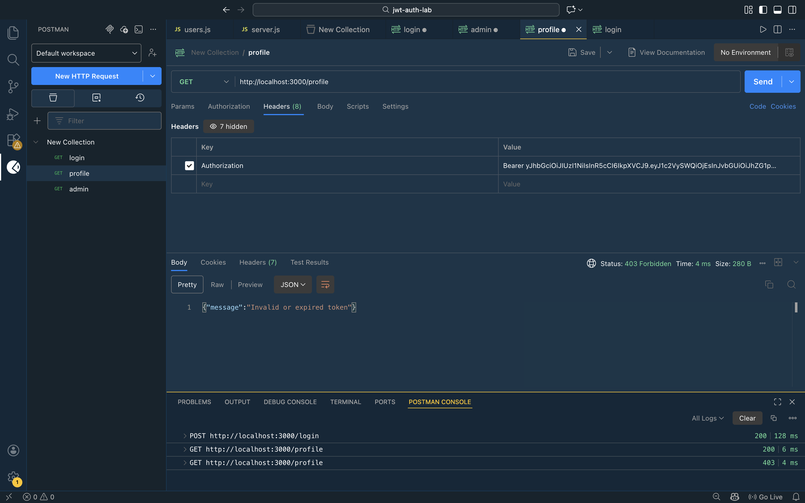
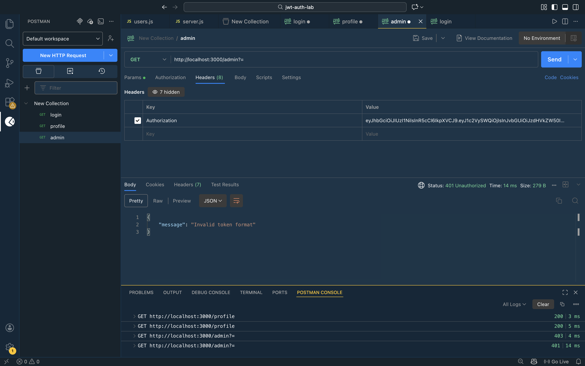

# jwt-auth-lab

## Screenshots

Admin login with username and password:

Admin profile response:

Admin access successful:

Student login with username and password:

Student profile response:

Student access denied to admin route:

Invalid token error:

Invalid token format error:

This README contains only information present in the project files (package.json, server.js, authMiddleware.js, users.js).

## package.json
- name: "jwt-auth-lab"
- version: "1.0.0"
- main: "authMiddleware.js"
- scripts:
  - "start": "node server.js"
- type: "commonjs"
- dependencies:
  - bcryptjs: "^3.0.3"
  - express: "^5.2.1"
  - jsonwebtoken: "^9.0.3"

## Server (server.js)
- Uses express, jsonwebtoken (jwt), bcryptjs, and local modules `./users` and `./authMiddleware`.
- SECRET_KEY constant in file: "YOUR_SECRET_KEY_HERE".
- Listens on port 3000 (console message: "Server running on port 3000").

### Routes
- POST /login
  - Expects `username` and `password` in the JSON request body.
  - Finds user by username using the `users` module.
  - Compares password using `bcrypt.compareSync` against the stored password.
  - On success, returns JSON with a JWT token: `{ token }`.
  - The JWT payload (as signed in the code) contains `{ userId: user.id, role: user.role }` and is signed with `SECRET_KEY` with `expiresIn: "1h"`.
  - On invalid credentials, responds with 401 and message: "Invalid username or password".

- GET /profile
  - Protected by `authenticateToken` middleware.
  - Responds with JSON containing `userId` and `role` from `req.user`.

- GET /admin
  - Protected by `authenticateToken` middleware.
  - Checks `req.user.role !== "admin"` and returns 403 with message "Access denied" if not admin.
  - On success returns `{ message: "Welcome Admin! You have full access." }`.

## Authentication middleware (authMiddleware.js)
- SECRET_KEY constant in file: "YOUR_SECRET_KEY_HERE".
- Middleware function `authenticateToken(req, res, next)`:
  - Reads `Authorization` header from `req.headers["authorization"]`.
  - If header missing, responds 401 with `{ message: "Token missing" }`.
  - Extracts token by splitting on space and taking the second part (expects format: "Bearer <token>").
  - If token missing after split, responds 401 with `{ message: "Invalid token format" }`.
  - Verifies token with `jwt.verify(token, SECRET_KEY, ...)`.
    - On verification error, responds 403 with `{ message: "Invalid or expired token" }`.
    - On success, attaches decoded payload to `req.user` and calls `next()`.

## Users (users.js)
- Exports an array `users` with two entries:
  - { id: 1, username: "admin", password: bcrypt.hashSync("admin123", 10), role: "admin" }
  - { id: 2, username: "student", password: bcrypt.hashSync("student123", 10), role: "student" }

(Passwords shown in the source are hashed using `bcrypt.hashSync` with the plaintext values "admin123" and "student123" passed into `hashSync`.)
